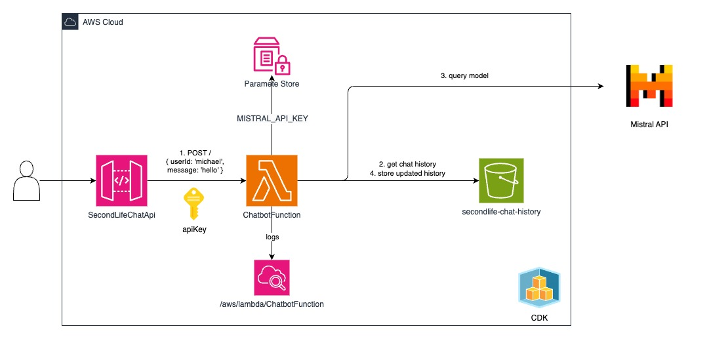

# SecondLife Chatbot API 🤖
This project creates a SecondLife chatbot service using AWS CDK. It deploys a serverless API that leverages the Mistral AI platform to provide conversational AI capabilities for SecondLife users.

## Overview
The SecondLife Chatbot API is a serverless application built with AWS CDK that:

- Provides an API endpoint for SecondLife clients to interact with AI
- Uses Mistral AI for natural language processing
- Stores conversation history in S3 for context-aware responses
- Secures API access with API keys
- Uses AWS Parameter Store for sensitive credentials

## Architecture


The application consists of:
- API Gateway: Handles HTTP requests with API key authentication
- Lambda Function: Processes requests, interacts with Mistral AI, and manages chat history
- S3 Bucket: Stores conversation history for each user
- Parameter Store: Securely stores the Mistral API key

## Prerequisites
- AWS Account
- AWS CLI configured with appropriate credentials
- Node.js 18.x or later
- AWS CDK v2 installed globally (npm install -g aws-cdk)
- Mistral AI API key (sign up at https://mistral.ai)

## Installation
1. Clone this repository:
```
git clone <repo-url>
cd secondlife-chatbot-api
```
2. Install dependencies:
```
npm install
```
3. Bootstrap your AWS environment for CDK (if not already done):
```
cdk bootstrap
```
4. Deploy the stack:
```
cdk deploy
```
5. After deployment, update the Mistral API key in AWS Parameter Store:
- Navigate to AWS Systems Manager > Parameter Store
- Find the parameter named /secondlife-chatbot/mistral-api-key
- Edit the parameter and replace the placeholder value with your actual Mistral AI API key

## Usage
**API Endpoint**
The API provides a single endpoint that accepts POST requests:
```
POST https://{api-id}.execute-api.{region}.amazonaws.com/prod/
```

**Authentication**
All requests must include an API key in the x-api-key header:
```
x-api-key: {your-api-key}
```

You can find the API key in the AWS Console under API Gateway > API Keys.

**Request Format**
```
{
  "userId": "avatar-uuid-123",
  "message": "Tell me about the history of SecondLife"
}
```
- userId: Optional. A unique identifier for the user/avatar. If not provided, a new UUID will be generated.
- message: Required. The text message from the user.

**Response Format**
```
{
  "userId": "avatar-uuid-123",
  "response": "SecondLife is a virtual world that was launched in 2003 by Linden Lab..."
}
```

## Chat History
The service stores conversation history for each user in S3, which allows the AI to maintain context across multiple interactions. By default, chat histories expire after 10 days.

## Development
### Project Structure
```
.
├── bin/
│   └── secondlife-chatbot-api.js    # CDK app entry point
├── lib/
│   └── secondlife-chatbot-api-stack.js  # Main stack definition
├── functions/
│   └── chatbot.js                  # Lambda function code
├── test/
│   └── secondlife-chatbot-api.test.js  # CDK tests
└── README.md
```

### Local Development
To test the CDK infrastructure locally:
```
npm test
```

### Making Changes
1. Edit the stack definition in secondlife-chatbot-api-stack.js
2. Edit the Lambda function in chatbot.js
3. Run cdk diff to see changes
4. Deploy with cdk deploy

## Testing
To test the API endpoint:
```
curl -X POST \
  https://{api-id}.execute-api.{region}.amazonaws.com/prod/ \
  -H 'Content-Type: application/json' \
  -H 'x-api-key: {your-api-key}' \
  -d '{"userId": "test-user", "message": "Hello, how are you?"}'
```

## Cleanup
To remove all deployed resources:
```
cdk destroy
```

Note: The S3 bucket is configured with RemovalPolicy.RETAIN to prevent accidental data loss, so you'll need to delete it manually if desired.

## License
This project is licensed under the MIT License - see the LICENSE file for details.